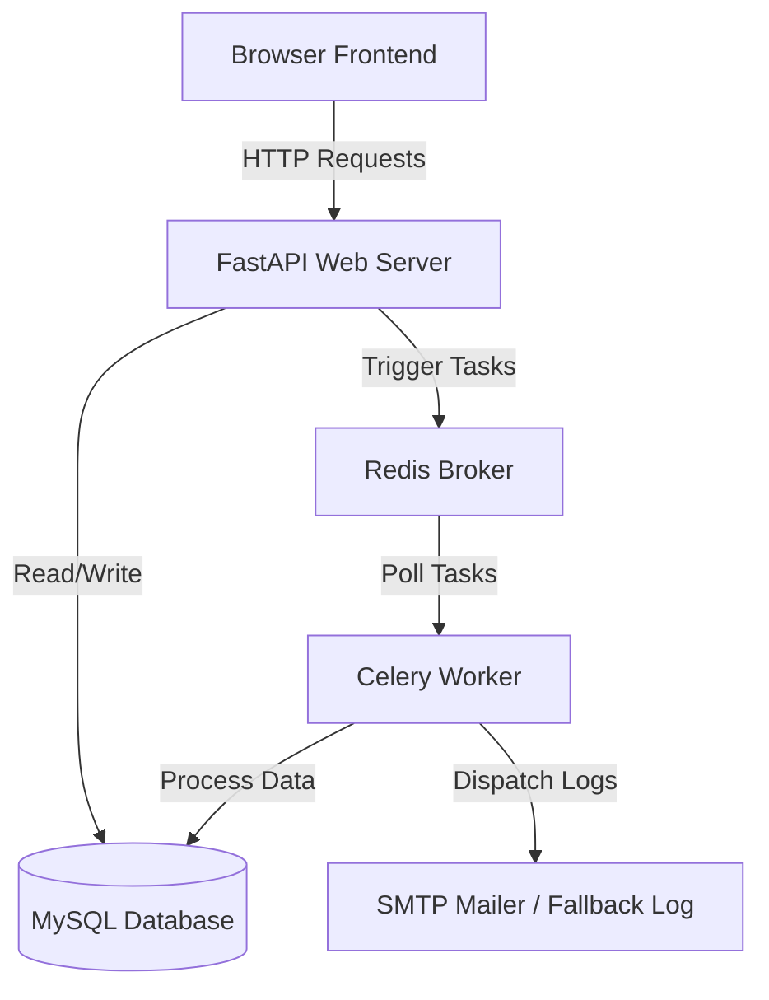

# Application Portal - System Documentation & Deployment Guide

This documentation details the architecture, configuration, commands, and deployment processes for the Secure Portal application.

---

## 🏗️ Architecture Overview

The system consists of a modern asynchronous API backend linked with a decoupled task-queue architecture and a responsive glassmorphic frontend.



* **Frontend**: Vanilla CSS, HTML5, and Javascript. Mounts statically onto FastAPI.
* **FastAPI Backend**: Asynchronous endpoints, JWT token authentication, model serialization.
* **Database**: MySQL database server. Tables structured and updated using Alembic migrations.
* **Task Broker (Redis)**: Memory database queueing asynchronous tasks.
* **Task Processor (Celery)**: Background worker executing dynamic file imports, CSV compilation, and email logs.
* **CI/CD Pipeline**: GitHub Actions running automated checks on every push.
* **Deployment Target**: AWS EC2 instance running docker-contained services.

---

## 🐍 1. FastAPI Backend

FastAPI acts as the API coordinator and serves the static frontend assets from the root path.

### Key Configuration
* **Database connection**: Configured dynamically through environment variables in `automation/app/core/database.py`.
* **Static Assets mounting**: Located in `automation/app/main.py`:
  ```python
  app.mount("/", StaticFiles(directory="../frontend", html=True), name="frontend")
  ```

### Developer Commands

#### running locally (Virtual Environment)
Ensure you are inside the `automation` subdirectory:
```powershell
# 1. Create virtual environment
python -m venv venv

# 2. Activate environment
# On Windows:
.\venv\Scripts\activate
# On Linux/macOS:
source venv/bin/activate

# 3. Install requirements
pip install -r requirements.txt

# 4. Start FastAPI server
uvicorn app.main:app --reload --host 127.0.0.1 --port 8000
```

#### Alembic Database Migrations
Migrations define database schemas incrementally.
```powershell
# Run all pending migrations to catch up the database
alembic upgrade head

# Create a new migration revision
alembic revision --autogenerate -m "description of database changes"
```

---

## 🐳 2. Docker & Docker Compose

Docker Compose coordinates the isolated microservice containers.

### Container Definitions (`docker-compose.yml`)
1. **`db`**: MySQL 8.0 server holding Courses, Students, and Users tables.
2. **`redis`**: Redis broker queueing Celery messages.
3. **`web`**: FastAPI app serving APIs and static files (port 8000).
4. **`worker`**: Celery worker executing tasks in the background.

### Memory Optimization (t3.micro Free Tier)
To fit within the tight 1 GB RAM limit on AWS Free Tier instances:
* **MySQL Cache**: Configured to run with reduced InnoDB memory constraints:
  ```yaml
  command: --key-buffer-size=16M --table-open-cache=64 --innodb-buffer-pool-size=64M
  ```
* **Celery Workers Concurrency**: Capped to a single process thread:
  ```yaml
  command: celery -A app.core.celery.celery_app worker --loglevel=info --concurrency=1
  ```

### Docker Commands
Run these commands from the root directory (where `docker-compose.yml` is located):
```bash
# Build and start all services in the background
docker compose up --build -d

# Stop and remove all running containers
docker compose down

# View stdout logs from all containers
docker compose logs -f

# View worker specific stdout logs
docker compose logs -f worker
```

---

## ⚙️ 3. Redis & Celery Workers

Celery offloads CPU-intensive operations (import processing and database CSV compiling) from the main API thread.

### Background Tasks
1. **`import_file_task`**: Decodes and parses uploaded CSV/JSON files, auto-resolves relationships, logs skips/duplicates, and triggers the completion email.
2. **`export_data_task`**: Compiles database tables into standard CSV layout strings.
3. **`send_email_task`**: Asynchronous notification runner connecting to SMTP configurations.

### Celery Commands
```bash
# Run worker manually (from automation/ folder)
celery -A app.core.celery.celery_app worker --loglevel=info
```

---

## 🚀 4. GitHub Actions CI/CD Pipeline

The configuration is declared in `.github/workflows/ci.yml`. It coordinates continuous integration testing and automated EC2 deployment.

### Pipeline Steps
1. **Test Job**:
   * Spins up a temporary isolated MySQL service container.
   * Installs Python 3.11 dependencies.
   * Runs Alembic migrations (`alembic upgrade head`) to setup schema.
   * Executes integration tests in `automation/tests/test_upload.py`.
2. **Deploy Job** (triggers only on merges to `main`/`master`):
   * Authenticates with your EC2 server via SSH.
   * Pulls the latest commits from the GitHub repository.
   * Restarts the Docker Compose services automatically.

### Required Secrets
Add these in your repository under **Settings -> Secrets and variables -> Actions**:
* `EC2_HOST`: Public IP of the AWS EC2 instance.
* `EC2_USER`: OS user (usually `ubuntu`).
* `EC2_SSH_KEY`: The text content of your EC2 private key file (`.pem`).

---

## ☁️ 5. AWS EC2 Deployment Guide

Follow these steps to deploy the application onto your AWS EC2 instance:

### Step 1: EC2 Firewall Setup (Security Groups)
In the AWS EC2 console, configure the Inbound Security rules for your instance:
* **Port 22 (SSH)**: Source `Anywhere` or `My IP`.
* **Port 80 (HTTP)**: Source `Anywhere`.
* **Port 443 (HTTPS)**: Source `Anywhere`.
* **Port 8000 (FastAPI)**: Source `Anywhere` (so you can access the app port directly).

### Step 2: Establish virtual Swap Space (2 GB)
Free Tier instances only have 1 GB RAM and will crash under container builds without a swap file. SSH into your instance and run:
```bash
# Create a 2GB empty file
sudo fallocate -l 2G /swapfile

# Set correct read/write permissions
sudo chmod 600 /swapfile

# Format file as swap
sudo mkswap /swapfile

# Activate swap
sudo swapon /swapfile

# Make swap persistent on system reboots
echo '/swapfile none swap sw 0 0' | sudo tee -a /etc/fstab
```

### Step 3: Install Docker on Host
```bash
# Install Docker Engine
sudo apt update && sudo apt upgrade -y
sudo apt install docker.io -y
sudo systemctl start docker
sudo systemctl enable docker

# Install Docker Compose V2
sudo apt install docker-compose-v2 -y

# Allow SSH user to run docker without sudo
sudo usermod -aG docker ubuntu
```
*Note: Make sure to log out of your SSH session (`exit`) and log back in for Docker permissions to take effect.*

### Step 4: Add Production `.env` File
Create a `.env` file inside `~/app/` on the host to set up secure credentials:
```ini
APP_NAME=Secure Portal
DEBUG=False
SECRET_KEY=long_random_secure_secret_phrase
MYSQL_DATABASE=fast_automation
MYSQL_USER=auto_user
MYSQL_PASSWORD=your_secure_db_password

SMTP_HOST=smtp.yourmail.com
SMTP_PORT=587
SMTP_USERNAME=smtp_auth_user
SMTP_PASSWORD=smtp_auth_password
SMTP_FROM=no-reply@yourdomain.com
SMTP_TLS=True
```
